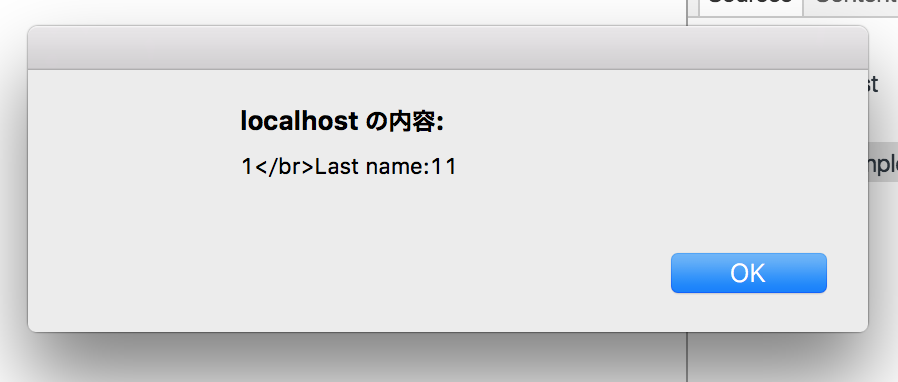

# POST, etc.

## POST 

### sample_send.php
```html
<!DOCTYPE html>
<html>
<head>
    <meta charset="UTF-8" />
    <title>sampel_send</title>
</head>
<body>
<form method="POST" action="sample_reception.php">
    <div id="container">
        <label for="name">Name</label>
        <input type="text" id="name" name="name" />
    </div>
    <input type="submit" value="Send" />
</form>
</body>
</html>
````
### sample_reception.php

````php
<!DOCTYPE html>
<html>
<head>
    <meta charset="UTF-8" />
    <title>sample_reception</title>
</head>
<body>
Hello! 
<?php
print htmlspecialchars($_POST['name'], ENT_QUOTES, 'UTF-8');
print "</br>";
var_dump($_POST);
?>
</body>
</html>
````
if don't use "htmlspecialchars" , when sending a "<script>alert('111');</script>" , it would have been executed.

### sample

````html
<!DOCTYPE html>
<html>
<head>
    <meta charset="UTF-8" />
    <title>sampel_send</title>
</head>
<body>
<form method="POST" action="sample_reception.php">
    <div id="container">
        <label for="name">First name</label>
        <input type="text" id="name" name="name" />
         <label for="name">Last name</label>
        <input type="text" id="name1" name="name1" />
    </div>
    <input type="submit" value="Send" />
</form>
</body>
</html>
````
````php
<!DOCTYPE html>
<html>
<head>
    <meta charset="UTF-8" />
    <title>sample_reception</title>
</head>
<body>
Hello! 

<?php
//print htmlspecialchars($_POST['name'], ENT_QUOTES, 'UTF-8');
print "</br>First name:";
print $_POST['name'];
print "</br>Last name:";
print $_POST['name1'];
?>

</body>
</html>
````
  
  
  
  
